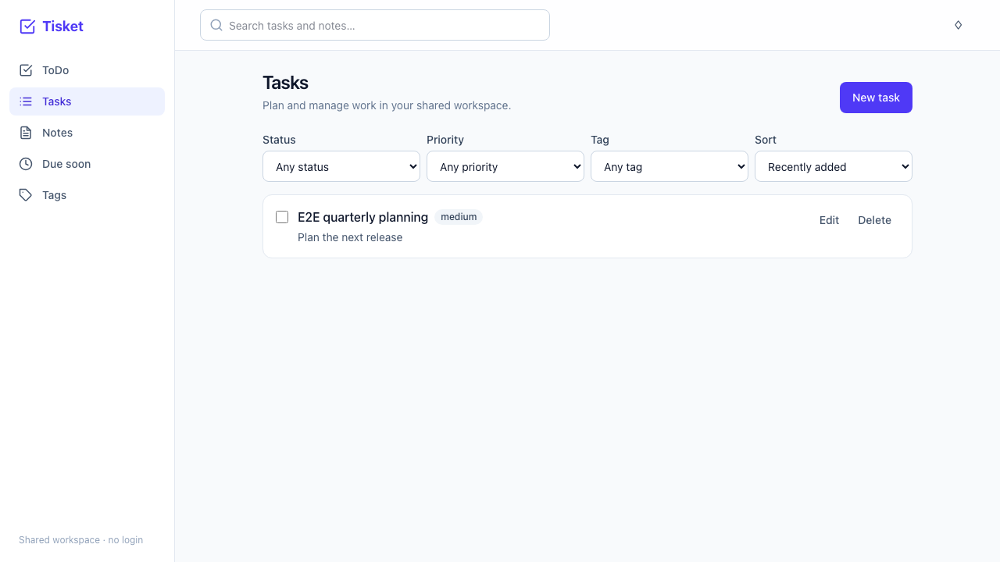
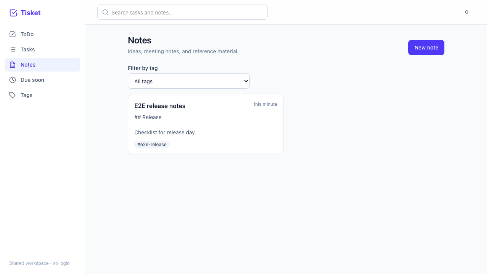
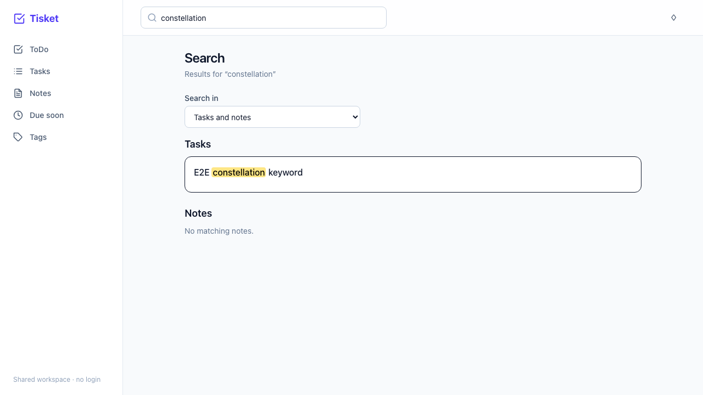

# Tisket

Tisket is a shared workspace for quick to-do lists, managed tasks, and Markdown notes. It has no
login: everyone who opens the app sees and edits the same data.

## Live app

Deployment is being configured. The public frontend and API links will be added here after the
Railway and Vercel projects are connected and verified.

## Screenshots

The end-to-end suite captures these screens using a fresh temporary SQLite workspace:

| Tasks                                     | Notes                                     | Search highlights                                          |
| ----------------------------------------- | ----------------------------------------- | ---------------------------------------------------------- |
|  |  |  |

## Features

- **ToDo:** quick-add tasks and check them off.
- **Tasks:** create, edit, delete, complete, filter, and sort tasks; set priority, status, due date,
  and tags.
- **Notes:** write and preview Markdown, pin notes, link notes to tasks, and add tags.
- **Tags:** organize and filter tasks and notes with shared labels.
- **Search:** search across tasks and notes, with matching text highlighted in results.
- **Reminders:** review overdue and upcoming tasks, and dismiss in-app notifications.
- **Responsive layout:** sidebar navigation on larger screens and bottom navigation on phones.

## Run locally

Prerequisites: Python 3.12, [uv](https://docs.astral.sh/uv/), Node.js 20 or newer, npm, and
PostgreSQL 16 for a local persistent workspace. The backend can also run with SQLite by setting
`DATABASE_URL` to a SQLite URL.

Install backend dependencies and configure the database:

```sh
cd backend
uv sync
cp .env.example .env
```

Set `DATABASE_URL` in `backend/.env` to your local PostgreSQL URL, then initialize the schema and
start the API:

```sh
uv run alembic upgrade head
uv run uvicorn app.main:app --reload
```

The API runs at `http://localhost:8000`; interactive API docs are at `http://localhost:8000/docs`.

In another terminal, install and start the frontend:

```sh
cd frontend
npm ci
cp .env.example .env.local
npm run dev
```

Open `http://localhost:5173`. The default `VITE_API_URL` points to the local API.

## Verify changes

From the repository root, the backend checks are:

```sh
cd backend
uv run ruff check .
uv run ruff format --check .
uv run mypy app
uv run pytest
```

The frontend checks are:

```sh
cd frontend
npm run lint
npm run format:check
npm run typecheck
npm test
npm run build
```

Playwright E2E tests use a fresh SQLite database and run the real API with a production frontend
build:

```sh
cd frontend
npx playwright install chromium
npm run e2e
```

The E2E flows cover task creation, note creation with tags, and highlighted search. They also
refresh the screenshots in `docs/screenshots/`. GitHub Actions runs the backend suite on SQLite and
PostgreSQL, frontend checks, and the Playwright suite on pushes and pull requests.

## Deployment

The backend is configured for Railway using `backend/Dockerfile` and `backend/railway.json`; the
frontend is configured for Vercel using `frontend/vercel.json`. Configure these variables in the
hosting dashboards:

| Service         | Variable          | Value                                                             |
| --------------- | ----------------- | ----------------------------------------------------------------- |
| Railway API     | `DATABASE_URL`    | `${{Postgres.DATABASE_URL}}`                                      |
| Railway API     | `APP_ENV`         | `production`                                                      |
| Railway API     | `ALLOWED_ORIGINS` | The Vercel site origin, such as `https://your-project.vercel.app` |
| Vercel frontend | `VITE_API_URL`    | The Railway API origin, such as `https://your-api.up.railway.app` |

Use `backend` as Railway's root directory and `frontend` as Vercel's root directory. Set the final
Vercel origin in Railway's `ALLOWED_ORIGINS`, then redeploy the API. Keep credentials in the hosting
provider's environment settings; do not commit them.
